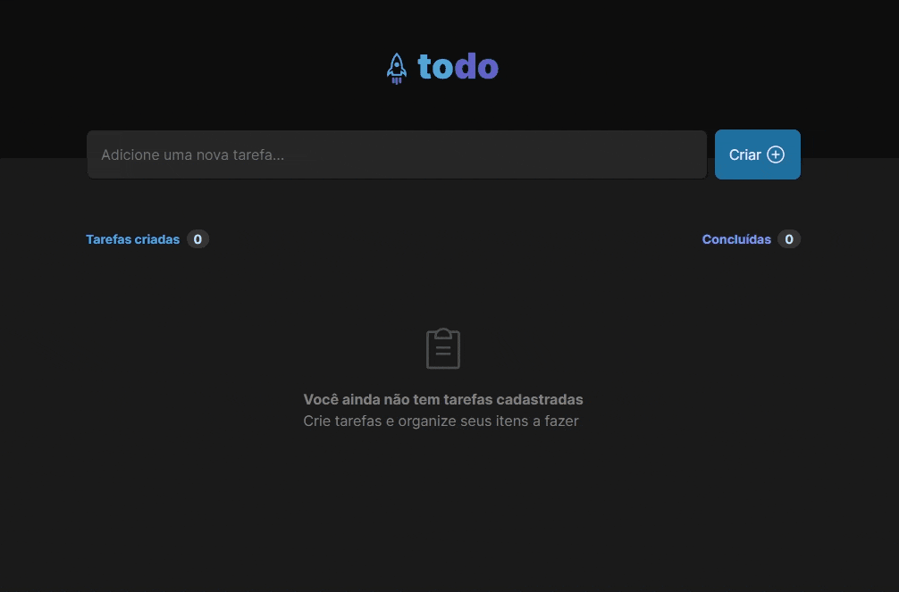

<p align="center">
  
</p>

## 💻 Sobre o projeto

Todo App foi criado para resolução do desafio do curso Ignite da Rocketseat.

<p align="center">
  
</p>

## 🚀 Instalação e uso

```bash
# Instale as dependências
npm install

# Execute a aplicação
npm run dev

# O servidor inciará na porta:3000 - acesse http://localhost:3000
```
